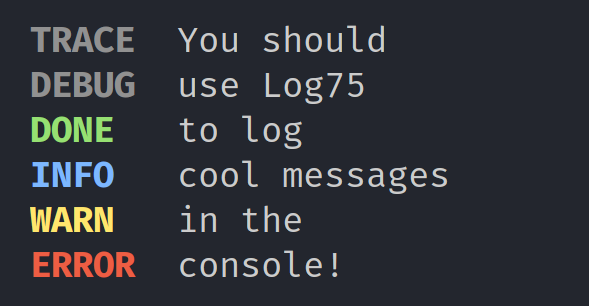

# Log75
[](./LICENSE.md)
[](https://nodejs.org/en/)
[](https://discord.gg/N8Fqcuk)

A convenient, lightweight text logging utility for Node.js

[](./)

## Usage
### Importing the module
```js
// Import the module
import Log75 from 'log75'
// or using CommonJS
const { default: Log75, LogLevel } = require('log75')
// Optionally, you can import log levels
// They are actually just 0, 1 and 2
import { LogLevel } from 'log75'

// The first parameter is the log level (a number from 0 to 2)
// The second parameter is a color toggle.
// Color will usually automatically be disabled if the terminal does not support it, but you can force it to be disabled by setting it to false
const logger = new Log75(LogLevel.Standard, true)
```

### Basic usage
```js
// LogLevel = Debug
logger.debug('i am a debug message')

// LogLevel = Standard
logger.done('i am a sucess message')
logger.info('i am information')
logger.warn('i am a warning')

// LogLevel = Quiet
logger.error('i am an error')
```

### Box creation
The logger can create neat looking boxes like this:
```
+-----------+
| I am text |
| inside a  |
| box       |
+-----------+
```

Use `logger.createBox(string[])` to create your box. This function does not output the message, you must do so separately
```js
logger.info(
    logger.createBox([
        'I am text',
        'inside a',
        'box'
    ])
)
```

## Log levels
There are 3 log level types.
Type     | Value
-------- | -----
Quiet    |   0
Standard |   1
Debug    |   2

The higher the low level, the more messages can be printed.
Message | Quiet | Standard | Debug
------- | ----- | -------- | -----
Error   |   +   |     +    |   +
Done    |       |     +    |   +
Info    |       |     +    |   +
Warn    |       |     +    |   +
Debug   |       |          |   +